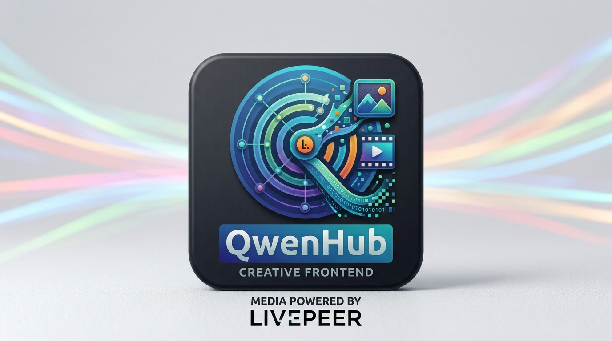

<p align="center">
  
</p>

<h1 align="center">🎬 QwenHub</h1>

<p align="center">
  <strong>Chat with Qwen. Direct Livepeer. Generate images & videos — no ComfyUI required.</strong>
</p>

<p align="center">
  
  
  
  
  
  
  
</p>

---

**QwenHub** is a standalone desktop chat app that turns natural language into images and videos through the [Livepeer Agent](https://agent.livepeer.org) network.

Describe a shot, attach a reference photo, or drop a previously generated clip — QwenHub picks the right Livepeer capability, writes the prompt, and polls the job until the media is ready. Everything happens inside one window: no ComfyUI, no node graph, no manual parameter tuning.

Built for the **Livepeer Agent Builder** hackathon track.

> A heavier, node-based version is also available in [`ComfyUI-QwenVL-Mod`](https://github.com/huchukato/ComfyUI-QwenVL-Mod).

## 📹 Demo

▶️ **[Watch the demo on Vimeo](https://vimeo.com/1228648577)** — text-to-image with `krea-2-large`, image-to-video with `minimax-h3-i2v`, a camera-change refinement, and the media library.

## ✨ Features

- 💬 **Natural-language director** — tell Qwen what you want in English or Italian.
- 🖼️ **Image generation** — `nano-banana`, `krea-2-large`, `flux-pro`, `gpt-image`, `recraft-v4`, `ideogram-v4`, and more.
- 🎞️ **Image-to-video & text-to-video** — `minimax-h3-i2v`, `kling-o3-i2v`, `ltx-i2v`, `ltx-t2v`, and more.
- 🎛️ **Capability selectors** — pick image/video mode and any of the ~200 real Livepeer capabilities from a dropdown; no need to memorize model names.
- 🔄 **Refine loop** — click any generated image or clip to use it as the next reference (images for i2v, videos for v2v).
- 🗂️ **Media library** — collapsible sidebar with every generated asset; click to reuse, save to disk, or delete.
- ⚙️ **In-app settings** — provider dropdown (OpenRouter, Ollama, llama.cpp, LM Studio, KoboldCpp, custom), API key, model, optional Livepeer key.
- 🌍 **EN / IT language switch** — frontend toggles between English and Italian.
- 🖥️ **Desktop app** — Electron wrapper with cross-platform builds.
- 🐳 **Optional web / Docker mode** — FastAPI backend for self-hosting.

## 🚀 Quick start (desktop)

```bash
cp .env.example .env
# edit .env: OPENAI_API_KEY + OPENAI_BASE_URL
npm install
npm start
```

Build a release:

```bash
npm run build:mac    # or :win / :linux
```

## 🌐 Web / server mode

```bash
cp .env.example .env
python -m venv .venv
source .venv/bin/activate
pip install -r requirements.txt
uvicorn main:app --reload
```

Open `http://localhost:8000`.

## 🐳 Docker

```bash
docker build -t qwenhub .
docker run -p 8000:8000 --env-file .env qwenhub
```

## ⚙️ Environment variables

| Variable | Default | Purpose |
|---|---|---|
| `OPENAI_BASE_URL` | `https://openrouter.ai/api/v1` | LLM API base URL |
| `OPENAI_API_KEY` | *(required)* | LLM API key |
| `MODEL` | `qwen/qwen3.8-27b:free` | Chat model |
| `LIVEPEER_API_KEY` | *(empty)* | Optional Livepeer key (demo mode works without it) |

### 💰 Free models on OpenRouter

Use the `:free` model variant suffix, e.g. `qwen/qwen-2.5-7b-instruct:free`, `qwen/qwen3.8-27b:free`, or the automatic `openrouter/free` router. Free endpoints are rate-limited and may be slower than paid ones.

### 🏠 Local Qwen / local LLM

Point `OPENAI_BASE_URL` to any OpenAI-compatible local server and set `OPENAI_API_KEY` to any non-empty string (or leave it empty if the server does not require auth):

- **Ollama**: `http://localhost:11434/v1` — model: `qwen2.5:7b`
- **llama.cpp server**: `http://localhost:8080/v1` — model: your GGUF filename
- **LM Studio**: `http://localhost:5000/v1` — model: loaded model name
- **KoboldCpp / text-generation-webui**: `http://localhost:5001/v1`

For local image understanding, the endpoint must support vision inputs in the chat completions format.

## 🏗️ Architecture

```
┌─────────────────┐     ┌──────────────────┐     ┌─────────────────┐
│   QwenHub UI    │────▶│  Electron main.js  │────▶│  OpenAI-compat  │
│  (EN / IT chat) │     │  LLM + Livepeer   │     │   LLM (Qwen)    │
└─────────────────┘     └──────────────────┘     └─────────────────┘
                                │
                                ▼
                         ┌──────────────┐
                         │ Livepeer MCP │
                         │ upload/run/  │
                         │   poll       │
                         └──────────────┘
                                │
                                ▼
                         ┌──────────────┐
                         │  output/     │
                         │  preview     │
                         └──────────────┘
```

## 📁 Project structure

```
QwenHub/
├── electron/
│   ├── main.js        # Electron main process (LLM + Livepeer)
│   └── preload.js     # Secure renderer bridge
├── static/
│   ├── index.html     # Chat UI (EN/IT)
│   └── icon.png       # In-app logo
├── img/
│   ├── icon.icns      # macOS app icon
│   ├── icon.png       # Windows/Linux icon
│   └── banner.jpeg    # README banner
├── main.py            # FastAPI backend (web mode)
├── livepeer_client.py # Raw MCP client for Livepeer (web mode)
├── llm_client.py      # OpenAI-compatible chat (web mode)
├── package.json
├── Dockerfile
└── requirements.txt
```

## 📝 License

GPL-3.0
